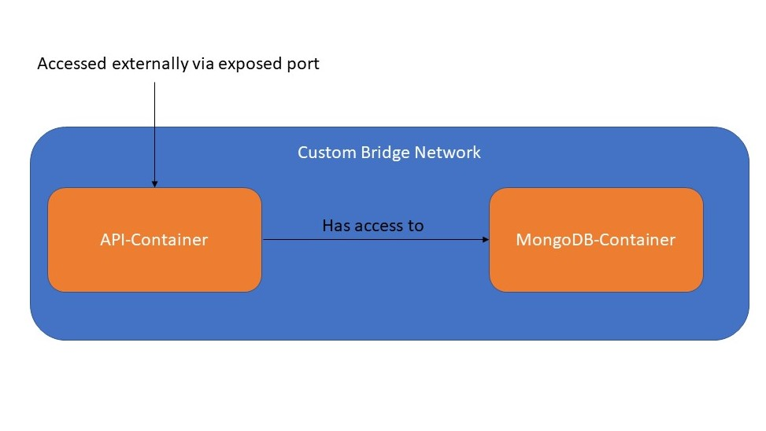
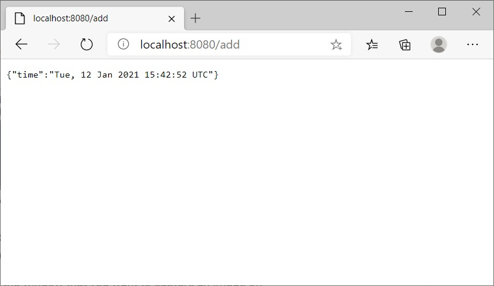
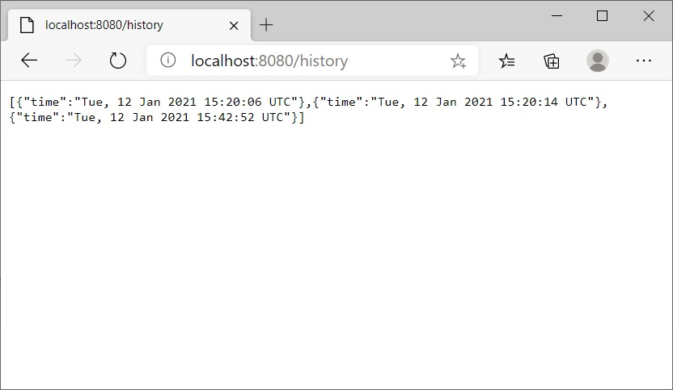

# Wie man Docker Container innerhalb eines benutzerdefinierten Bridge Netzwerks kommunizieren lässt
<!-- TOC -->

- [Wie man Docker Container innerhalb eines benutzerdefinierten Bridge Netzwerks kommunizieren lässt](#wie-man-docker-container-innerhalb-eines-benutzerdefinierten-bridge-netzwerks-kommunizieren-l%C3%A4sst)
    - [Voraussetzungen](#voraussetzungen)
    - [Beschaffen der Images](#beschaffen-der-images)
    - [Ein benutzerdefiniertes Bridge Netzwerk erzeugen](#ein-benutzerdefiniertes-bridge-netzwerk-erzeugen)
    - [Container mit dem Netzwerk verbinden](#container-mit-dem-netzwerk-verbinden)
    - [Zusammenfassung](#zusammenfassung)

<!-- /TOC -->
Docker ist eine Open Platform, die es ermöglicht, eine Anwendung in einer isolierten Umgebungen auszuführen. Diese isolierten Anwendungen werden als Container bezeichnet und spielen eine wichtige Rolle in modernen Cloud Technologien. Während Docker Images (diese werden zum Erzeugen von Containern verwendet) in Plattformen wie Kubernetes und Cloud Foundry ausgeführt werden können, ist es auch möglich lediglich Docker zu verwenden, um Container zu erzeugen und diese in einer eigenen Umgebung und einem eigenen Netzwerk auszuführen. Docker nutzt containerd als Container Runtime welche auch durch Kubernetes bis zu Version [1.20 verwendet werden kann](https://kubernetes.io/blog/2020/12/02/dont-panic-kubernetes-and-docker/ "Kubernetes deprecating Docker as runtime").
Dadurch ist es für Entwickler leicht, mit Docker Anwendungen und Images zu erzeugen, die durch verschiedene Plattformen genutzt werden können.

Falls Anwendungen in Docker ausgeführt werden, kann es vorkommen, dass ein Container in einem isolierten Netwerk benötigt wird (beispielsweise wenn eine Datenbank nicht in anderen Netzwerken sichtbar sein, aber trotzdem auf eine Art erreichbar sein soll). Dies lässt sich realisieren indem ein benutzerdefiniertes Bridge Netzwerk, ein Link-Layer zwischen verschiedenen Netzwerksegmenten, erzeugt wird und Container mit diesem Netzwerk verbunden werden. Ein Bridge Netzwerk in Docker ist eine Software-Bridge die Containern, die damit Verbunden sind, eine Kommunikation untereinander ermöglicht, während diese isoliert von Containern sind, die sich nicht in diesem Netzwerk befinden. Weitere Informationen zu Bridge Netzwerken in Docker findes du in den [Docker Docs](https://docs.docker.com/network/bridge/ "Docker Bridge Netzwerke").

Dieses Tutorial beschreibt Schritt für Schritt, wie man einen Container (MongoDB) in einem benutzerdefinierten Bridge Netzwerk einrichtet, mit diesem über einen anderen Container (eine einfache HTTP API) kommuniziert, der sich im selben Netwerk befindet und wie man auf diesen Container zugreift (und einige Requests an die API sendet), indem ein Port sichtbar gemacht wird.

*Übersicht des benutzerdefinierten Bridge Netzwerks und seinen Containern*

## Voraussetzungen
* Docker
* Genug Speicherplatz: Ungefähr 500 MB für das MongoDB Image (die Größe des MongoDB Images kann sich allerdings ändern) und 20 MB für das Image, welches für dieses Tutorial erstellt wurde

Bis auf Docker wird für dieses Tutorial nichts benötigt, da das Image der zu containerisierenden Anwendung bereits existiert. Falls du zuerst die Grundagen von Docker lernen oder ein eigenes Image erstellen möchtest, findest du einige nützliche Guides und Tutorials auf der [Docker Website](https://docs.docker.com/get-started/ "Docker get started").

## Beschaffen der Images
Zuerst holen wir das offizielle MongoDB Image von [Docker Hub](https://hub.docker.com/_/mongo "MongoDB Docker Hub"). Dies geschieht durch den CLI-Befehl **docker pull** gefolgt von dem Namen des Images, welcher in unserem Fall **mongo** lautet (dadurch wird das MongoDB Image mit dem Tag **latest** geholt). Der vollständige Befehl sieht wie folgt aus:
```
docker pull mongo
```
Anschließend holen wir das Image, das für dieses Tutorial erstellt wurde:
```
docker pull maxfuhrich/container-network-example
```
Falls du es vorziehst, dein eigenes Image zu erzeugen, anstatt das Beispiel-Image zu verwenden, darfst du den Code (und die Dockerfile) aus dem Github Repository gerne dafür verwenden.
Um zu sehen ob die Images erfolgreich beschafft wurden, können wir diese auflisten mit:
```
docker image ls
```
Dadurch werden alle Images angezeigt, die lokal verfügbar sind. Falls alles geklappt hat, sollten wir beide Images finden, die wir gerade beschafft haben. Falls du davor bereits Images geholt haben solltest, könnten mehr Images als die beiden benötigten aufgelistet werden.
## Ein benutzerdefiniertes Bridge Netzwerk erzeugen
Als nächstes wollen wir ein benutzerdefiniertes Netzwerk erzeugen. Dies geschieht durch den CLI-Befehl **docker network create** gefolgt von dem Namen, den das Netzwerk haben soll, welcher in unserem Fall **hello-network** lautet. Der vollständige Befehl sieht wie folgt aus:
```
docker network create hello-network
```
Dadurch wird ein Bridge Netzwerk mit dem Namen **hello-network** erzeugt. Ein [Bridge Netzwerk](https://docs.docker.com/network/bridge/ "Use bridge networks") ist ein Netzwerk in welchem Container untereinander kommunizieren können, während diese von Containern isoliert sind, die nicht mit dem Netzwerk verbunden sind.

Um zu sehen ob das Netzwerk erfolgreich erzeugt wurde, können wir folgenden Befehl verwenden:
```
docker network ls
```
Wenn unser Netzwerk hier aufgelistet wird, wurde es erzeugt!
```
docker network ls
NETWORK ID     NAME            DRIVER    SCOPE
e99d15db1b9a   bridge          bridge    local
cc423edba456   hello-network   bridge    local
c5096c5db5a1   host            host      local
ddf6427be1bc   none            null      local
```
Standardmäßig ist der für das Netzwerk verwendete Treiber der Bridge Treiber. Eine Übersicht der verschiedenen Netzwerktreiber und deren Anwendungsfälle findet sich [hier](https://www.docker.com/blog/understanding-docker-networking-drivers-use-cases/ "Docker networking drivers use cases").

**Hinweis**: Falls du nach dem Tutorial dein Netzwerk nicht mehr benötigst, kannst du es entfernen mit:
```
docker network rm hello-network
```
## Container mit dem Netzwerk verbinden
Jetzt werden wir den MongoDB Container erzeugen, ausführen und mit dem Netzwerk **hello-network** verbinden. Der Container kann mit dem Befehl **docker run** ausgeführt werden, gefolgt vom Namen des Images, welcher in unserem Fall **mongo** lautet:
```
docker run -d --name mongodb --network hello-network mongo
```
**-d** führt den Container im Hintergrund aus, wodurch wir das Terminal weiter verwenden können.

**--name** legt den Namen des zu erzeugenden Containers fest (**mongodb**). Falls **--name** nicht angegeben wird, erhält der Container einen zufälligen String als Namen.

**--network** legt das Netzwerk fest, mit dem der Container verbunden sein wird (**hello-network**).

**Wichtig**: Ändere nicht den Namen des MongoDB Containers, da der andere Container den Namen verwendet um diesen in eine IP-Adresse aufzulösen. Dies wird als *automatische Service Discovery* bezeichnet. Falls du keine automatische Service Discovery verwenden möchtest, kannst du die IPv4Addresse des MongoDB Containers verwenden, die du erhältst, wenn du das Netzwerk inspizierst (dies wird nicht mit dem Code aus dem Beispiel funktionieren, da der HTTP-Container versucht, sich mit dem Host **mongodb** zu verbinden).

Das einzige, was jetzt noch zu tun ist, ist den HTTP-Container zu erzeugen, auszuführen, mit **hello-network** zu verbinden und einen Port sichtbar zu machen, wodurch von außen darauf zugegriffen kann:
```
docker run -d --name http-container --network hello-network -p 8080:8080 maxfuhrich/container-network-example
```
**-p** "host-port:container-port" mappt einen TCP Port des Containers (8080) an einen Port des Hosts (8080). Falls der Port 8080 des Hosts bereits verwendet wird, kannst du stattdessen einen anderen Port verwenden, der noch frei ist.

**Hinweis**: Falls du den Output der HTTP-Anwendung im Terminal sehen möchtest, kannst du die **-d** Flag weglassen.

Um zu sehen, ob unsere Container in unserem benutzerdefinierten Bridge Netzwerk laufen, können wir dieses mit dem Befehl **docker inspect** gefolgt vom Namen des Netzwerks, **hello-network**, inspizieren:
```
docker inspect hello-network
```
Dadurch wird folgender Output erzeugt:
```
[
    {
        "Name": "hello-network",
        "Id": "cc423edba4561250791ecc63970cccdb4341b644864b27443dcc1ff5fbdacc2a",
        "Created": "2021-01-12T14:50:53.9820995Z",
        "Scope": "local",
        "Driver": "bridge",
        "EnableIPv6": false,
        "IPAM": {
            "Driver": "default",
            "Options": {},
            "Config": [
                {
                    "Subnet": "172.18.0.0/16",
                    "Gateway": "172.18.0.1"
                }
            ]
        },
        "Internal": false,
        "Attachable": false,
        "Ingress": false,
        "ConfigFrom": {
            "Network": ""
        },
        "ConfigOnly": false,
        "Containers": {
            "48ca87014d0f6b656fbda0ffd8c6d1402cfab0dda0dd1032abcf45a1bb64b990": {
                "Name": "http-container",
                "EndpointID": "...",
                "MacAddress": "00:00:aa:00:00:00",
                "IPv4Address": "172.18.0.3/16",
                "IPv6Address": ""
            },
            "83cd03b01c5c37295d8861a42cffd7aa3fbba4856c9b158c3e10866008b6a902": {
                "Name": "mongodb",
                "EndpointID": "...",
                "MacAddress": "00:00:aa:00:00:01",
                "IPv4Address": "172.18.0.2/16",
                "IPv6Address": ""
            }
        },
        "Options": {},
        "Labels": {}
    }
]
```
Falls alles funktioniert hat, sollten wir in unserem Browser *localhost:8080/hello* (*localhost:8080* funktioniert auch) aufrufen können, wodurch ein String ausgegeben wird.

Der Endpoint */add* erzeugt einen neuen Eintrag in der Datenbank der lediglich einen String mit der aktuellen Uhrzeit beinhaltet (und gibt diesen Eintrag an den Aufrufenden aus):


**Hinweis**: In der Praxis sollte dieser Endpoint POST verwenden, jedoch wird für diesen Guide GET verwendet, damit er über den Browser aufrufbar ist.

Der Endpoint */history* gibt alle Einträge der Datenbank aus:



Glückwunsch, wir haben erfolgreich eine Multi-Container-Anwendung in einem benutzerdefinierten Bridge Netzwerk erzeugt!

Da dies das Ende des Tutorials ist, sollten wir ein paar Aufräumarbeiten durchführen. Zunächst müssen wir die Container stoppen. Dies geschieht durch den Befehl **docker container stop** gefolgt von den Namen der Container, die wir stoppen möchten, **http-container** und **mongodb**. Als nächstes können wir die Container mit dem Befehl **docker container rm** entfernen, gefolgt von den Containernamen **http-container** und **mongodb**. Zum Schluss entfernen wir unser benutzerdefiniertes Netzwerk mit **docker network rm** und dem Namen des Netzwerks **hello-network**.
In unserer CLI sehen die drei Befehle wie folgt aus:
```
docker container stop http-container mongodb
docker container rm http-container mongodb
docker network rm hello-network
```

## Zusammenfassung
In diesem Guide hast du gelernt, wie man ein benutzerdefiniertes Netzwerk erzeugt, Container damit verbindet, diese mithilfe von automatischer Service Discovery kommunizieren lässt und den Port eines Containers für den Host sichtbar macht. Dieser Ansatz funktioniert auch mit Containern anderer Anwendungen, beachte allerdings, mit welcher IP/Host der API Container versucht sich zu verbinden.

Weiterführende Links:
* [Docker Docs: Networking with standalone containers](https://docs.docker.com/network/network-tutorial-standalone/ "Docker network tutorial")
