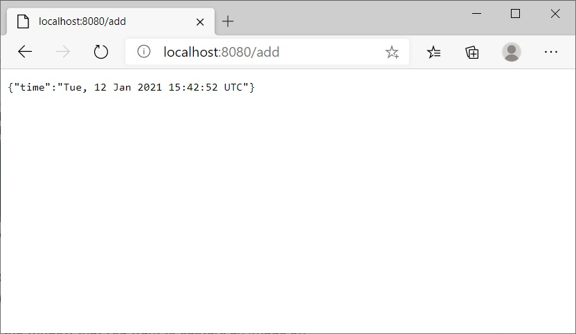
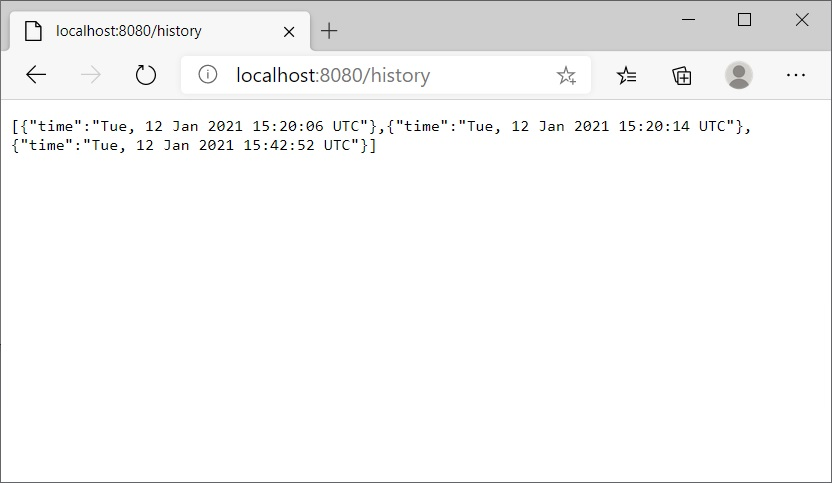

# Communicating with Docker containers in custom bridge networks
There are situations in which a container in an isolated network is needed (e.g. if the database must not be exposed to outer networks but still be accessible in a way).
This guide describes, how you can set up a container (MongoDB) in a custom bridge network and communicate with it via another container (a simple HTTP API) that is connected to the custom bridge and the default bridge network and how you can connect to this container (and make some calls to the api).
The project used for this example can be found at https://github.com/MaxFuhrich/container-network-guide

## Prequisites
* Docker

## Getting the images
First, get the image of MongoDB:
```
docker pull mongo
```
Then, get the example image:
```
docker pull maxfuhrich/container-network-example
```
If you prefer to build your own image instead of using the example image, feel free to use the code (and the Dockerfile) from the github repository.
To see if the images have been pulled successfully you can list them with:
```
docker image ls
```
## Creating a custom bridge network
Next, we want to create a custom network
```
docker network create hello-network
```
This will create a network with the name "hello-network".
To check if the network has been successfully created you can write:
```
docker network ls
```
If your network is listed there, it has been created!
```
docker network ls
NETWORK ID     NAME            DRIVER    SCOPE
e99d15db1b9a   bridge          bridge    local
cc423edba456   hello-network   bridge    local
c5096c5db5a1   host            host      local
ddf6427be1bc   none            null      local
```
By default, the used driver for the network is the bridge driver.

**Note**: If you don't need your network anymore you can remove it with:
```
docker network rm hello-network
```
## Connect the containers to the network
Create & run the MongoDB container and connect it to the network "hello-network"
```
docker run -d --name mongodb --network hello-network mongo
```
The flag -d runs the container detached so that you can use the terminal again.

**Important**: Don't change the name of the MongoDB container as the other container uses this name to resolve it into an IP-address. This is called *automatic service discovery*. If you don't want to use automatic service discovery you can use the IPv4Address of the MongoDB container, which you get if you inspect the network (this won't work with the code as is, because the HTTP container tries to connect to the host "mongodb").

Now, the only thing that is left is to create & run the HTTP container, connect it to hello-network and expose a port so that the host can access it:
```
docker run -d --name http-container --network hello-network -p 8080:8080 maxfuhrich/container-network-example
```
**-p** "host-port:container-port" publishes/maps a TCP port in the container (8080) on a port on the host (8080). If the port 8080 on the host is already in use, you can change the port to any other one that is free.

**Note**: You can omit the -d flag if you want to see the output of the HTTP application in your terminal.

To check if your containers are running in your custom bridge network you can inspect it:
```
docker inspect hello-network
```
Which outputs:
```
[
    {
        "Name": "hello-network",
        "Id": "cc423edba4561250791ecc63970cccdb4341b644864b27443dcc1ff5fbdacc2a",
        "Created": "2021-01-12T14:50:53.9820995Z",
        "Scope": "local",
        "Driver": "bridge",
        "EnableIPv6": false,
        "IPAM": {
            "Driver": "default",
            "Options": {},
            "Config": [
                {
                    "Subnet": "172.18.0.0/16",
                    "Gateway": "172.18.0.1"
                }
            ]
        },
        "Internal": false,
        "Attachable": false,
        "Ingress": false,
        "ConfigFrom": {
            "Network": ""
        },
        "ConfigOnly": false,
        "Containers": {
            "48ca87014d0f6b656fbda0ffd8c6d1402cfab0dda0dd1032abcf45a1bb64b990": {
                "Name": "http-container",
                "EndpointID": "...",
                "MacAddress": "00:00:aa:00:00:00",
                "IPv4Address": "172.18.0.3/16",
                "IPv6Address": ""
            },
            "83cd03b01c5c37295d8861a42cffd7aa3fbba4856c9b158c3e10866008b6a902": {
                "Name": "mongodb",
                "EndpointID": "...",
                "MacAddress": "00:00:aa:00:00:01",
                "IPv4Address": "172.18.0.2/16",
                "IPv6Address": ""
            }
        },
        "Options": {},
        "Labels": {}
    }
]
```
If everything went right you should be able to call *localhost:8080/hello* in your browser, which returns a string.

The endpoint */add* creates a new entry that only contains a string with the current time in our database (and returns this entry to the caller):



**Note**: In practice this endpoint should use POST but for this guide GET is used so that it can be accessed via browser.

The endpoint */history* shows all elements of the database:



Congratulations, you successfully created a multi-container application in a custom bridge network!

To stop and remove the containers and the custom bridge network:
```
docker container stop http-container mongodb
docker container rm http-container mongodb
docker network rm hello-network
```

## Wrap Up
In this guide you learned, how to create a custom network, connect containers to it, let them communicate via automatic service discovery and expose a port of one container to the host.

Further reading:
* [Docker Docs: Networking with standalone containers](https://docs.docker.com/network/network-tutorial-standalone/ "Google's Homepage")
